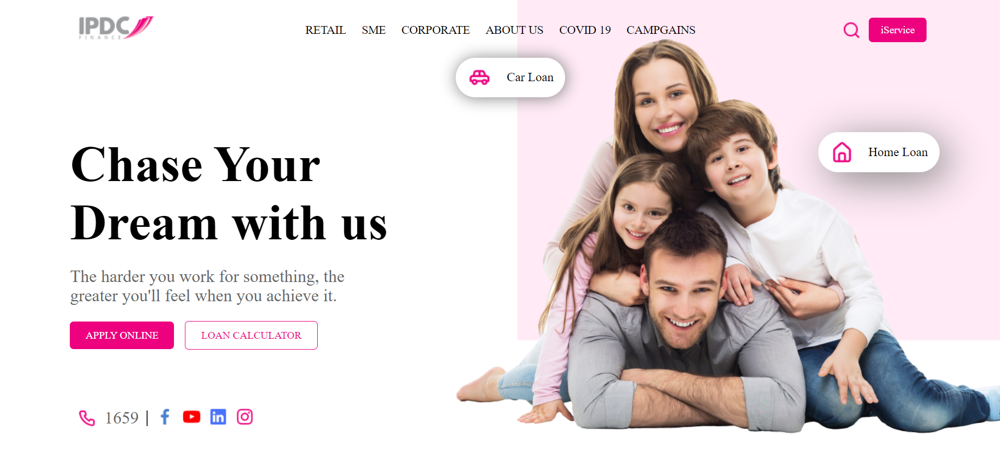

## Web Page UI Clone

In this project user has to create the clone of the given below image. The project need not to be responsive.

> All the required assets are given in the **Assets** folder.

## Tech Used

- HTML
- CSS

### Expected Output

